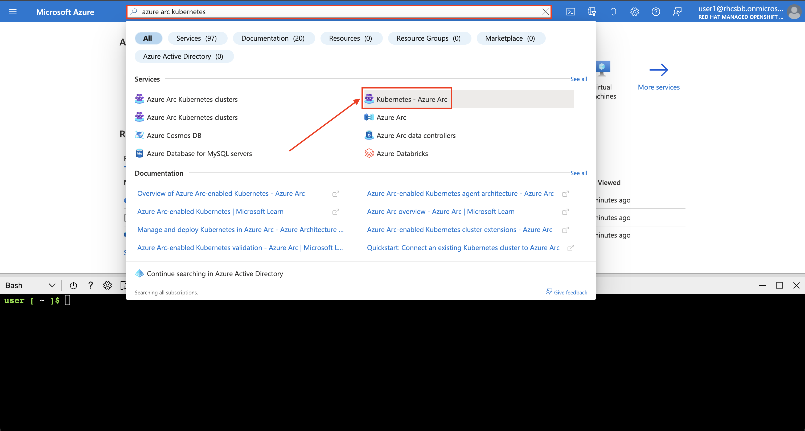
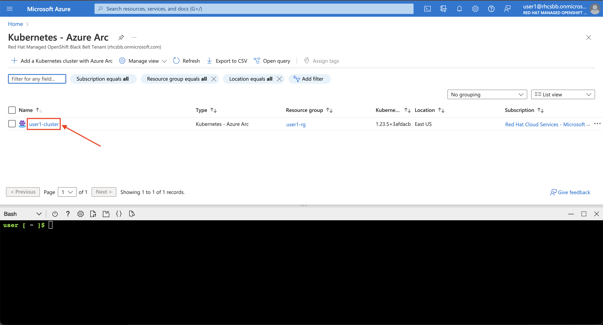
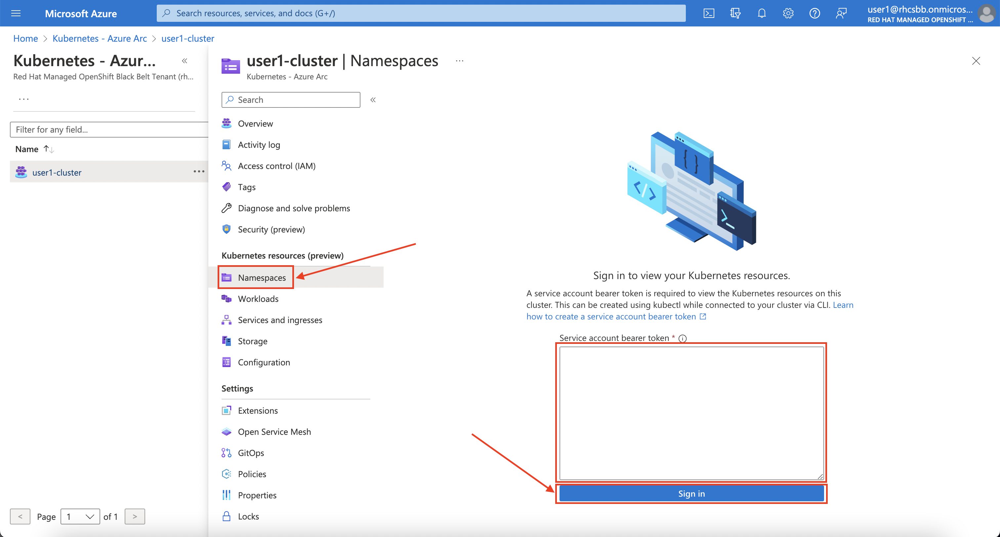
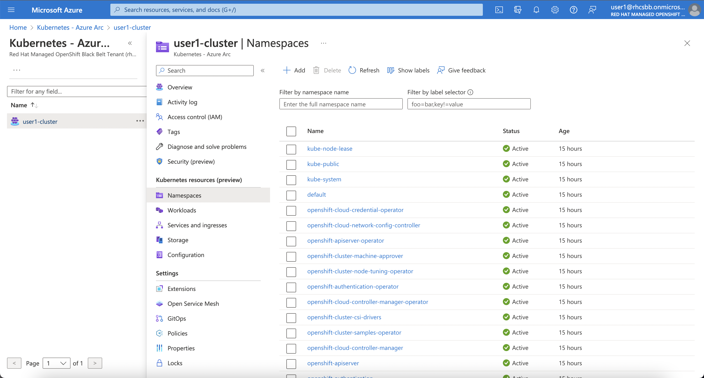

1. In order to see ARO resources (such as namespaces, pods, services, etc.) inside Azure Arc, you need to create a service account and provide the token to Azure Arc. To do so, run the following command:

    ```bash
    oc -n azure-arc create serviceaccount azure-arc-observability
    oc create clusterrolebinding azure-arc-observability-rb --clusterrole cluster-admin --serviceaccount azure-arc:azure-arc-observability
    ```

1. Next, we need to create a secret to store our token. To do so, run the following command:

    ```bash
    cat <<EOF | oc apply -f -
    apiVersion: v1
    kind: Secret
    metadata:
      name: azure-arc-observability-secret
      namespace: azure-arc
      annotations:
        kubernetes.io/service-account.name: azure-arc-observability
    type: kubernetes.io/service-account-token
    EOF
    ```

1. Then, we can obtain the token for Azure Arc. To do so, run the following command:

    ```bash
    token=$(oc -n azure-arc get secret azure-arc-observability-secret -o jsonpath='{$.data.token}' | base64 -d)
    ```

    Make sure you copy this value, as you'll need it in a moment.


1. Next, In the Azure Portal search for "Kubernetes Azure Arc" and click on the *Kubernetes - Azure Arc* option.

    

    !!! warning "Ensure that you DO NOT click on Azure Arc Kubernetes clusters!"

1. Select your cluster name from the page.

    

1. Then, select *Namespaces* from the left side menu and paste the token from step three in the *Service account bearer token* field.

    

    You can now see and explore through the following OpenShift resources inside the Azure Arc portal:

    - Namespaces
    - Workloads
    - Services and Ingress
    - Storage
    - Configurations

    
